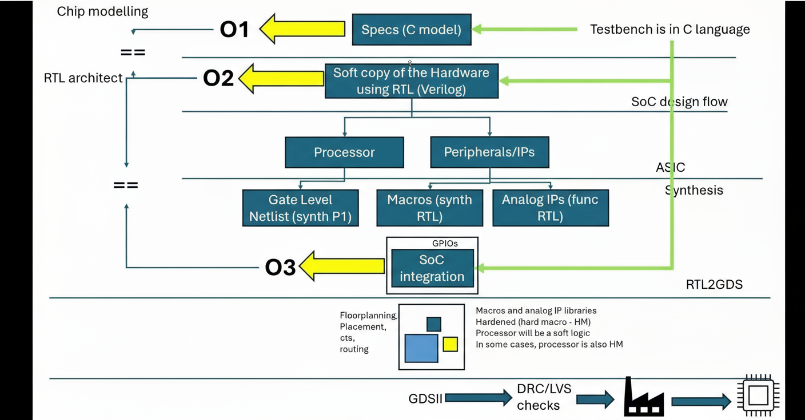

# vsd-riscv-tapeout-week0
“EDA Tools installation for VSD course Week 1”

# Week 1 - Tools Installation

# Task 1: Summary of Video

Summary of the video:

* Firstly, to verify an application, we should write the C program for that and then run it using GCC compiler.  
* Next, implement that same logic using the specification of the processor we are going to use.  
* Then, write the softcopy of the hardware, which is the RTL logic (Verilog).  
* Further, the RTL is classified as:
  * Processor → Synthesizable to provide gate-level netlist.  
  * Peripherals/IPs → Classified as:
    * Macros (Synthesizable)  
    * Analog IPs (Functional)  
* Next step is SoC Integration.  
* Then, RTL → GDS.  
* Finally, it is given to industry to get the chip, which is known as Tapeout.  

## Task 2: Tool Installation

**Tools Installed on Ubuntu VM and Verified Versions:**

VirtualBox:
VirtualBox is a virtualization software that allows running Linux on a Windows host. It is used to install and test EDA tools in an isolated environment.

Yosys:
Yosys is an open-source RTL synthesis tool that converts Verilog designs into gate-level netlists, preparing the design for layout tools or FPGA implementation.

Icarus Verilog (iverilog):
Icarus Verilog is a Verilog simulator that verifies RTL designs using testbenches before synthesis, generating simulation outputs for analysis.

GTKWave:
GTKWave is a waveform viewer for simulation outputs (VCD files) and is used to visualize signal behavior over time to debug and verify digital designs.

#Commands to install tools

Steps to intall yosys
Yosys 
$ sudo apt-get update 

$ git clone https://github.com/YosysHQ/yosys.git 

$ cd yosys 

$ sudo apt install make (If make is not installed please install it)  

$ sudo apt-get install build-essential clang bison flex \ 
libreadline-dev gawk tcl-dev libffi-dev git \ 
graphviz xdot pkg-config python3 libboost-system-dev \ 
libboost-python-dev libboost-filesystem-dev zlib1g-dev 

$ make config-gcc 

$ make  

$ sudo make install

Steps to install iverilog 
Iverilog 
$ sudo apt-get update 

$ sudo apt-get install iverilog 

Steps to install gtkwave 
gtkwave 
$ sudo apt-get update 

$ sudo apt install gtkwave 

## Notes:
- Screenshots are taken from Ubuntu VM showing installed versions.  
- All tools are installed successfully as per Week 1 instructions.  
- This repo documents Task 1 and Task 2 for Week 1 of VSD-RISC-V Tapeout course.
